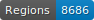

# HTR-SETAF-Pierre-de-Vingle
 Data for the SETAF project

   

## Data

ALTO files with segmentation and transcription fully corrected manually.

## Licence

Transcriptions are open source, not the images which belong to libraries.

## Citation

Sonia Solfrini, Data for the SETAF project, université de Genève, 2023.
