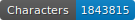
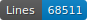
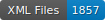

# HTR-SETAF-Pierre-de-Vingle
Données pour le projet SETAF

   

## Projet SETAF

GitHub du Projet : https://github.com/SETAFDH 

Site du projet : https://www.unige.ch/setaf

## Financeur

Ce projet est financé par le Fonds national suisse (FNS).

## Données HTR

Les données se trouvent au chemin ‘./data//.xml‘. Elles sont au format ALTO et suivent les normes de segmentation SegmOnto (https://segmonto.github.io). Toutes les données sont produites à l'aide de l'interface eScriptorium et sont cataloguées sur HTR-United (https://htr-united.github.io). Les fichiers ALTO sont corrigés manuellement : la segmentation a déjà été corrigée et la trascription sera bientôt corrigée. 

## Infrastructure

Les données pour l'HTR sont produites à l'aide de l’instance genevoise FoNDUE (https://www.unige.ch/lettres/humanites-numeriques/recherche/projets-de-la-chaire/fondue) d'eScriptorium (https://gitlab.com/scripta/escriptorium).

## Licence

Les transcriptions sont open source, mais les images appartiennent aux bibliothèques.

## Citer le projet

à venir
